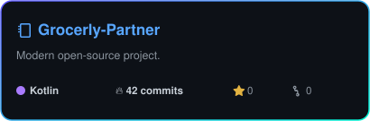
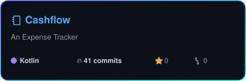
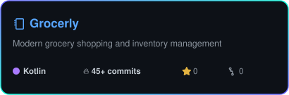
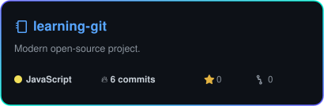

  <!-- ═══════════════════════════════════════════════════════ -->
  <!--           DYNAMIC CONTINUOUS HUE-ROTATING HEADER        -->
  <!-- ═══════════════════════════════════════════════════════ -->
  <picture>
    <source media="(prefers-color-scheme: dark)" srcset="assets/header-aurora.svg">
    <source media="(prefers-color-scheme: light)" srcset="assets/header-aurora.svg">
    
  </picture>

  <!-- ═══════════════════════════════════════════════════════ -->
  <!--               DYNAMIC TYPING ANIMATION                 -->
  <!-- ═══════════════════════════════════════════════════════ -->
  

    

  <!-- ═══════════════════════════════════════════════════════ -->
  <!--               SOCIAL & PROJECT BADGES                  -->
  <!-- ═══════════════════════════════════════════════════════ -->
  
  
  

    

  <!-- ═══════════════════════════════════════════════════════ -->
  <!--                     ABOUT ME                           -->
  <!-- ═══════════════════════════════════════════════════════ -->
  

    💡 Passionate about building modern, snappy, offline-first Android applications. 
    📱 Focused on scalable architectures, clean Material 3 UI, and seamless user experiences. 
    🌱 Continuously exploring high-performance Jetpack Compose, Room databases, and modern Android stack.
  

   

  <!-- ═══════════════════════════════════════════════════════ -->
  <!--                  TECH STACK & TOOLS                    -->
  <!-- ═══════════════════════════════════════════════════════ -->
  <h3>🛠️ Tech Stack &amp; Tools</h3>
  <a href="https://skillicons.dev">
     
    
  </a>

    

  <!-- ═══════════════════════════════════════════════════════ -->
  <!--               ⭐ POPULAR REPOSITORIES                  -->
  <!-- ═══════════════════════════════════════════════════════ -->
  <h3>⭐ Popular Repositories</h3>
  
Top active open-source projects auto-synced by commit activity &amp; latest updates:

<!-- POPULAR-REPOS:START -->
  

    
    
     
    
    
  

<!-- POPULAR-REPOS:END -->

   

  <!-- ═══════════════════════════════════════════════════════ -->
  <!--       GITHUB STATS & TOP LANGUAGES (LIGHT/DARK)       -->
  <!-- ═══════════════════════════════════════════════════════ -->
  <h3>📈 GitHub Activity &amp; Overview</h3>

  

    <picture>
      <source media="(prefers-color-scheme: dark)" srcset="https://github-stats-extended.vercel.app/api?username=Hevin-CJ&show_icons=true&theme=radical&hide_border=true&title_color=635BFF&icon_color=00F5D4&text_color=FFFFFF&bg_color=0D1117" />
      <source media="(prefers-color-scheme: light)" srcset="https://github-stats-extended.vercel.app/api?username=Hevin-CJ&show_icons=true&theme=default&hide_border=true&title_color=635BFF&icon_color=0969DA&text_color=24292F&bg_color=FFFFFF" />
      
    </picture>
    <picture>
      <source media="(prefers-color-scheme: dark)" srcset="https://github-stats-extended.vercel.app/api/top-langs/?username=Hevin-CJ&layout=compact&theme=radical&hide_border=true&title_color=635BFF&text_color=FFFFFF&bg_color=0D1117" />
      <source media="(prefers-color-scheme: light)" srcset="https://github-stats-extended.vercel.app/api/top-langs/?username=Hevin-CJ&layout=compact&theme=default&hide_border=true&title_color=635BFF&text_color=24292F&bg_color=FFFFFF" />
      
    </picture>
  

  <!-- ═══════════════════════════════════════════════════════ -->
  <!--           CONTRIBUTION ACTIVITY (LIGHT/DARK)          -->
  <!-- ═══════════════════════════════════════════════════════ -->
  <h3>⚡ Contribution Activity</h3>
  <picture>
    <source media="(prefers-color-scheme: dark)" srcset="https://github-readme-activity-graph.vercel.app/graph?username=Hevin-CJ&theme=react-dark&bg_color=0D1117&color=635BFF&line=00F5D4&point=FFFFFF&hide_border=true&area=true" />
    <source media="(prefers-color-scheme: light)" srcset="https://github-readme-activity-graph.vercel.app/graph?username=Hevin-CJ&theme=github-light&bg_color=FFFFFF&color=635BFF&line=0969DA&point=24292F&hide_border=true&area=true" />
    
  </picture>

    

  <!-- ═══════════════════════════════════════════════════════ -->
  <!--       CONTRIBUTION SNAKE ANIMATION (LIGHT/DARK)       -->
  <!-- ═══════════════════════════════════════════════════════ -->
  <h3>🐍 Annual Contribution Trail</h3>
  <picture>
    <source media="(prefers-color-scheme: dark)" srcset="https://raw.githubusercontent.com/Hevin-CJ/Hevin-CJ/output/github-contribution-grid-snake-dark.svg" />
    <source media="(prefers-color-scheme: light)" srcset="https://raw.githubusercontent.com/Hevin-CJ/Hevin-CJ/output/github-contribution-grid-snake.svg" />
    
  </picture>

   

  <!-- ═══════════════════════════════════════════════════════ -->
  <!--           DYNAMIC CONTINUOUS HUE-ROTATING FOOTER        -->
  <!-- ═══════════════════════════════════════════════════════ -->
  <picture>
    <source media="(prefers-color-scheme: dark)" srcset="assets/footer-aurora.svg">
    <source media="(prefers-color-scheme: light)" srcset="assets/footer-aurora.svg">
    
  </picture>

